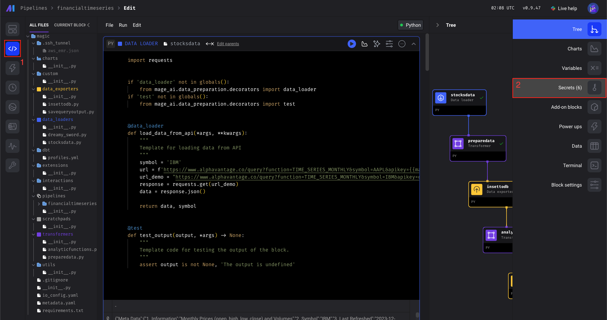
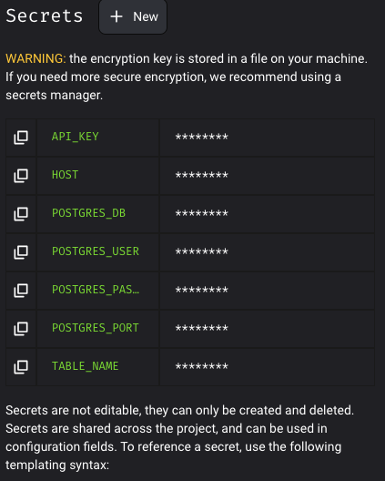
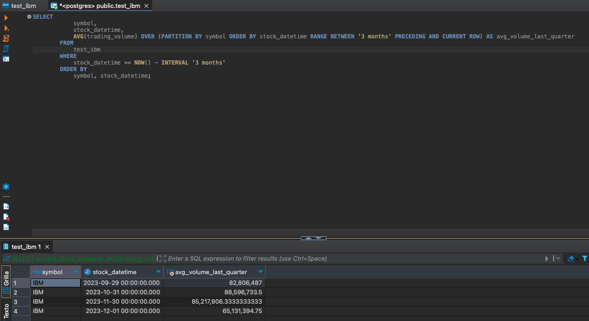

# Setup

## APIs
### Stocks Data
Grab an API KEY from advantage data:
- https://www.alphavantage.co/support/#api-key
- Save this for setting up in mage secrets

## Create .env
- For this project you will need the following variables:
```
POSTGRES_SCHEMA
POSTGRES_USER
POSTGRES_PASSWORD
POSTGRES_HOST
PG_HOST_PORT
POSTGRES_DB
```
## Command
1. open terminal
2. change direcotry to the path where you clone the repo
3. run the docker compose
```
docker compose up
```

## Set secrets in Mage
For setting up the secrets you need to go:
- 1 to edit pipeline
- 2 to secrets
- 3 start adding
- [Documentation](https://docs.mage.ai/development/variables/secrets)



## SQL Analytic Function output


## Tools
- Mage
- TimeScaleDB
- Docker
