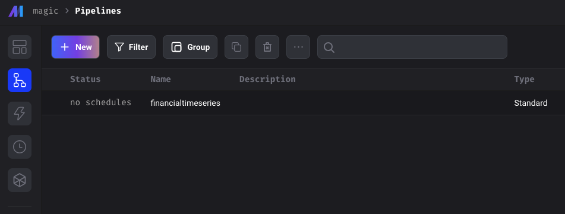
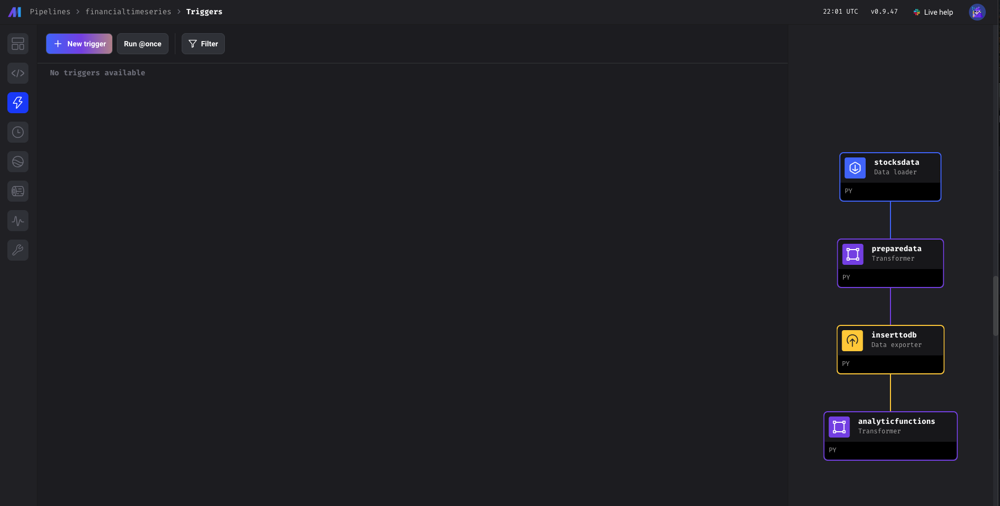
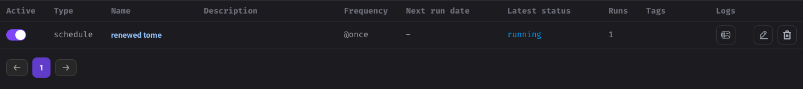

# Architecture Desing
- I decided to go with MAGE as orchestrator tool because this is incredible easy to use and also makes a good modularization for the execution plan.

- For the scripting part I used python, because it was the required programming language and it has great compatibility with orchestration tools as Airflow, Mage, Dagster.

- For Storage, I use timescaleDB as in this project is required to use TIME SERIES data, which I pull from alphavantage API. This type of DB are by default configured to partition and index records by a timestamp column so at the moment it was not necessary to make indexing or clustering. 

- I choose DBeaver to interact with the database.

# Setup

## APIs
### Stocks Data
Grab an API KEY from advantage data:
- https://www.alphavantage.co/support/#api-key
- Save this for setting up in mage secrets

## Create .env
- For this project you will need the following variables:
```
POSTGRES_SCHEMA
POSTGRES_USER
POSTGRES_PASSWORD
POSTGRES_HOST
PG_HOST_PORT
POSTGRES_DB
```
## Command
1. open terminal
2. change direcotry to the path where you clone the repo
3. run the docker compose
```
docker compose up
```
4. after docker compose finishes go to ```http://{port}:6789/pipelines```

## Set secrets in Mage
For setting up the secrets you need to go:
- 1 to edit pipeline
- 2 to secrets
- 3 start adding
- [Documentation](https://docs.mage.ai/development/variables/secrets)


<br>
- Here are all the SECRETS needed: <br>


## Pipeline Import
- Go to the dir where you have the docker-compose.yml
- There should be two new dirs:
    - mage_data
    - magic
- copy all the files inside financialtimeseries inside the magic folder
```
cp ./financialtimeseries/* ./magic/
```
- You now should see the pipeline in the browser



- click on the pipeline name and it would navigate to the triggers section



- hit on Run @once and in the pop-up run now, after a while you should see:



## Pipeline Order
- 1 [PullData](./financialtimeseries/data_loaders/stocksdata.py)
- 2 [PrepareData](./financialtimeseries/transformers/preparedata.py)
- 3 [InsertToDB](./financialtimeseries/data_exporters/inserttodb.py)
- 4 [Analytics](./financialtimeseries/transformers/analyticfunctions.py)

## SQL Analytic Function output


## Tools
- [Mage](https://docs.mage.ai/introduction/overview)
- [TimeScaleDB](https://docs.timescale.com/)
- [Docker](https://docs.docker.com/)
- [DBeaver Community](https://dbeaver.io/download/)
